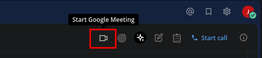
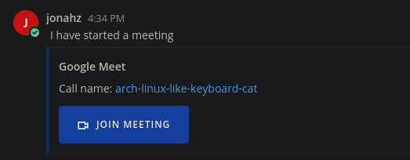

# Mattermost Plugin Google Meet
[](https://github.com/adfinis/mattermost-plugin-google-meet/actions/workflows/ci.yml)

> Note: This plugin doesn't work for @gmail.com accounts because they don't have permission to create meetings by the `https://g.co/meet/` url.

The **Google Meet Plugin** adds a button in the header bar in all channels:  


When a user press the button, a message with the meeting link is automatically sent for the channel:  


The meeting room link is either a random string, uuid or based on the team and the channel names.

## Usage & Setup Guide

### Installation

1. Download the latest release from https://github.com/adfinis/mattermost-plugin-google-meet/releases/
2. In Mattermost, go to **System Console > Plugins > Plugin Management**.
3. Select **Choose File** to upload the plugin file.

### Commands

The following commands are provided by this plugin:

* `/gmeet` to create a new meeting.
* `/gmeet start [topic]` to start a meeting with a specific name.
* `/gmeet settings` to manage your preferences.  

## Contribute

We value every contribution, be it an issue, discussion or pull request!

### Development

Start a local server
```sh
# https://docs.mattermost.com/install/docker-local-machine.html
podman compose up -d
```

Create the first account with `admin` as login and `password` as password.

Run to install:
```sh
sh make.sh
```

#### Translation

Bliblablub


## About this fork

This fork builds on top of [@SrMouraSilva work](https://github.com/SrMouraSilva/mattermost-google-meet-plugin) and implemented the following changes:

* `com.adfinis.gmeet` is the new plugin ID (if you installed an old version of this plugin, please remove it before installing our fork).
* You can now use slash commands to interact with the plugin.
* The plugin build system has been updated and adapted to the latest [starter-template](https://github.com/mattermost/mattermost-plugin-starter-template).


## Acknowledgment

* [@SrMouraSilva](https://github.com/SrMouraSilva) for writing this plugin initially.
* [gmccullough](https://stackoverflow.com/users/2281071/gmccullough) for the ["g.co/meet/" trick](https://stackoverflow.com/a/62313196/1524997);
* [@lauraseidler](https://github.com/lauraseidler) and [@hmhealey](https://github.com/hmhealey) for the help with breaking changes in the version 5.35+;
* [@lauraseidler](https://github.com/lauraseidler) and [@hmhealey](https://github.com/hmhealey) for the help with breaking changes in the version 5.35+;
* [@yodapotatofly](https://github.com/yodapotatofly) and [@oneWaveAdrian](https://github.com/oneWaveAdrian) for translations.

## Maintainer Information

This plugin is maintained by:

* Adfinis AG | [Website](https://adfinis.com) | [GitHub](https://github.com/adfinis)
